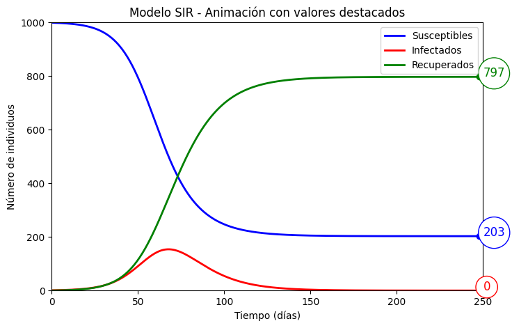

# 📊 Modelo SIR en Jupyter Notebook

Este proyecto implementa el modelo epidemiológico clásico **SIR** (Susceptibles – Infectados – Recuperados) en Python, utilizando **Jupyter Notebook**.  
Se comparan tres métodos de integración numérica: **Euler**, **Runge–Kutta de orden 4 (RK4)** y **RK45 adaptativo** de SciPy.  
Incluye una visualización clara de la evolución de la epidemia y una imagen explicativa del modelo.


---

## 🧠 ¿Qué es el modelo SIR?

El modelo SIR divide la población en tres compartimentos:
- **S (Susceptibles):** individuos que pueden contraer la enfermedad.
- **I (Infectados):** individuos que están infectados y pueden contagiar.
- **R (Recuperados):** individuos que ya no pueden infectarse ni contagiar.

Las transiciones están gobernadas por dos parámetros:
- **β (beta):** tasa de contagio.
- **γ (gamma):** tasa de recuperación.


---

## 🚀 Características del proyecto

- Simulación del modelo SIR con tres métodos numéricos:
  - Euler (simple y didáctico)
  - RK4 (preciso y estable)
  - RK45 (adaptativo, vía `solve_ivp`)
- Comparación visual de resultados.
- Código limpio y modular.
- Imagen explicativa del modelo incluida.

## ⚙️ Requisitos

Instala las dependencias con:

```bash
    pip install numpy matplotlib scipy
```


